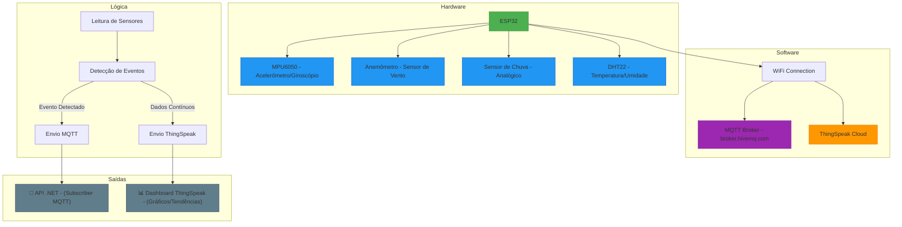

# AlertHaven - Sistema de Detecção de Desastres Naturais

## Visão Geral
Solução IoT para monitoramento ambiental em tempo real capaz de detectar eventos extremos como tempestades, tornados, terremotos e outros desastres naturais.
As informações detectadas são publicadas via **MQTT** e registradas na plataforma **ThingSpeak**, com dados de sensores simulados e reais (MPU6050, anemômetro e sensor de chuva).

## Tecnologias Utilizadas

### Hardware
- **ESP32**: Microcontrolador principal
- **MPU6050**: Sensor de movimento (acelerômetro/giroscópio)
- **Anemômetro**: Medição de velocidade do vento  
- **Sensor de Chuva**: Detecção de precipitação
- **DHT22**: Sensor de temperatura/umidade (opcional)

### Software
- **PlatformIO**: Ambiente de desenvolvimento
- **Arduino Framework**: Programação do ESP32
- **Protocolo MQTT**: Comunicação com broker (HiveMQ público)
- **ThingSpeak**: Plataforma IoT para visualização de dados

### Bibliotecas
- `WiFi.h`: Conexão WiFi
- `PubSubClient.h`: Comunicação MQTT  
- `ArduinoJson.h`: Manipulação de payloads JSON
- `Adafruit_MPU6050.h`: Leitura do sensor de movimento
- `ThingSpeak.h`: Integração com plataforma cloud

## Fluxo de Comunicação

1. O ESP32 simula/mede dados dos sensores conectados.
2. Detecta eventos com base em regras predefinidas.
3. Publica os dados via **MQTT** no tópico `alerthaven/eventos`.
4. Registra os dados simultaneamente na plataforma **ThingSpeak**.

## Lógica de Detecção de Eventos

| Evento          | Condição de Detecção                                             |
|----------------|-------------------------------------------------------------------|
| **Alagamento**     | Chuva > 3500 (escala 0-4095)                                     |
| **Tempestade**     | Chuva > 3000 **e** vento > 500 RPM                               |
| **Tornado**        | Vento > 800 RPM                                                 |
| **Onda de Calor**  | Temperatura > 40 °C                                              |
| **Terremoto**      | Aceleração em X ou Y > 3.0 m/s²                                  |

A simulação percorre 6 fases alternando entre condições normais e eventos climáticos, com alteração automática a cada 10 segundos.

## 🔩 Componentes Principais

| Componente        | Modelo/Tipo                  | Função                                                  |
|-------------------|------------------------------|----------------------------------------------------------|
| **Microcontrolador** | ESP32 DevKit V1              | Unidade central de controle e comunicação                |
| **Sensor de Chuva**  | Analógico (Wokwi Rain Sensor) | Detecta presença e intensidade de chuva (0–4095)         |
| **Anemômetro**       | Digital (Wokwi Anemometer)   | Mede a velocidade do vento em rotações por minuto (RPM)  |
| **Sensor Inercial (IMU)** | MPU6050 (I2C)              | Mede aceleração (usado para detecção de terremotos)      |
| **Wi-Fi**            | Integrado ao ESP32           | Comunicação com a Internet, MQTT Broker e ThingSpeak     |
| **MQTT Broker**      | broker.hivemq.com            | Plataforma para publicar e assinar mensagens de eventos  |
| **ThingSpeak**       | Canal `2969337`              | Armazenamento e visualização de dados dos sensores       |

## Diagrama de Arquitetura do Sistema




## Instalação
1. Clonar repositório
```cpp
git clone https://github.com/vitorvhsilva/AlertHaven-IoT.git
```

2. Abrir no PlatformIO
```cpp
pio project init --ide vscode
```

3. Executar o Build do projeto e rodar o Workwi no diagram.json

## Exemplo de Saída
```bash
{
  "device": 3232321,
  "evento": 2,
  "timestamp": 1650000000,
  "chuva": 3750,
  "vento": 620,
  "temperatura": 23.5,
  "aceleracaoX": 0.12,
  "aceleracaoY": 0.05
}
```
